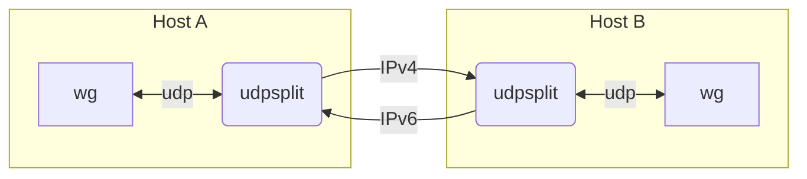

# udpsplit

A surprisingly simple UDP forwarder that splits WireGuard up/down traffic into
separated streams, one direction over IPv4 and the other over IPv6.

Basically, it just
- Listen on UDP port `--port` from everywhere;
- When a packet is recived from localhost, remeber that address, and forward
  the packet to `--remote`;
- Whenever a non-localhost packet is received, forward it to that localhost;

So if you run
- `udpsplit --port 1000 --remote host-B-ipv6:2222` on host A; and
- `udpsplit --port 2222 --remote host-A-ipv4:1000` on host B; and
- For one of hosts A or B, set its WireGuard peer endpoint to localhost.

You now setup a WireGuard VPN with A => B over IPv6 and B => A over IPv4!

In addition, udpsplit re-resovles `--remote` frequently, so it works with
DDNS without extra configure.

## But why?

- Bypass some bizarre firewalls and/or QoS policies.

- If this happends to you, your dual-stack Internet sucks but only sucks
  on one direction on each version of IP protocl. (...)
